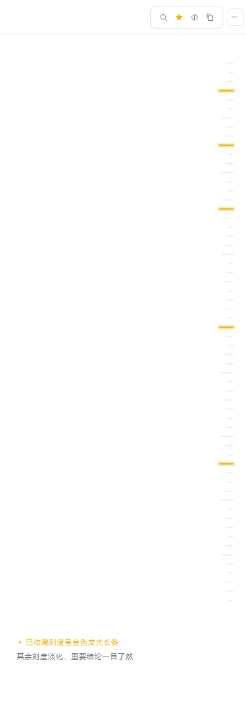
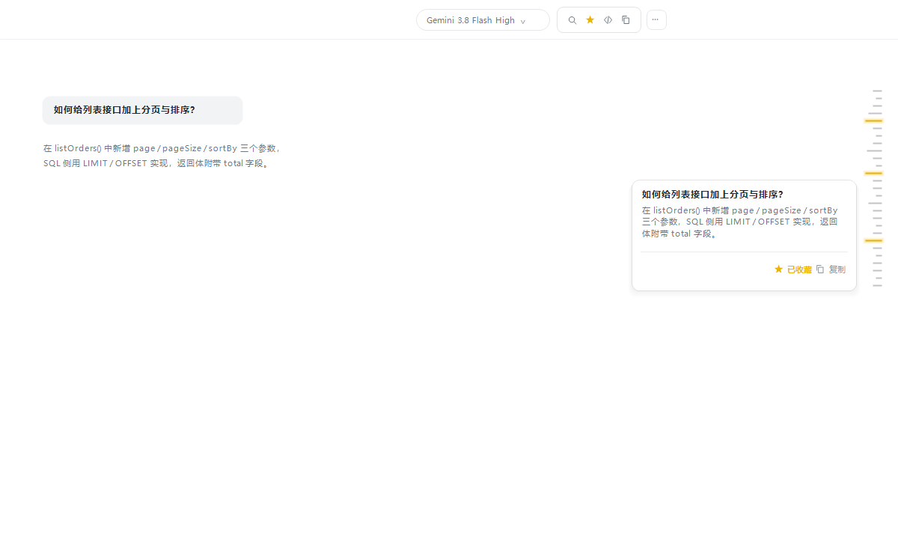

# dsh-chat-toc

[中文](README.md) · [English](README.en.md)

Un plugin de índice de conversación para la GUI web de DSH: una barra de esquema estilo libro en el borde derecho del chat; pasa el ratón para expandir el índice, haz clic en cualquier entrada para ir a ese mensaje.

## Características

- **Barra de índice**: pegada al borde derecho del área de chat (a la izquierda de la flecha de colapso del panel de Git). Cada mensaje es una marca — cuanto más larga la marca, más contenido; los mensajes de usuario son azules, los del asistente verdes
- **Resaltado de posición actual**: al desplazarte, la marca del mensaje actual se resalta (sincronizado entre la barra y la lista desplegable)
- **Expandir al pasar el ratón**: mueve el ratón a la barra para ver el índice completo (barra de color por rol + número + resumen del mensaje); se contrae automáticamente al salir
- **Búsqueda en el índice**: el índice expandido tiene un buscador que filtra los mensajes por resumen/clave en tiempo real (sin distinción de mayúsculas), ideal para localizar y saltar a mensajes históricos
- **Marcadores de mensajes**: pase el ratón por cualquier entrada del índice y toque la estrella (⭐) para marcar mensajes clave (p. ej. conclusiones, contratos API); la cabecera del índice tiene un filtro de un clic "solo destacados"; los marcadores persisten en localStorage del navegador
- **Clic para ir al mensaje**: haz clic en cualquier entrada para desplazarte suavemente hasta el mensaje correspondiente
- **Multilingüe**: sigue el idioma de la interfaz web de DSH (chino / inglés); los navegadores en español reciben automáticamente el texto en español; por defecto chino simplificado
- Tema claro / oscuro siguiendo la GUI web de DSH; coexiste con dsh-git-panel, las posiciones se ajustan automáticamente

## Capturas de pantalla

**Barra de índice** (marcas en el borde derecho del chat tras varias interacciones; el mensaje actual se resalta):



**Índice desplegado al pasar el ratón** (barra de color por rol + número + resumen, clic para ir al mensaje):



## Instalación

```sh
dsh plugin --profile web add dsh-chat-toc
```

Reinicia `dsh web` y, tras varias interacciones de la conversación, la barra de índice aparece en el borde derecho del chat.

> Para desarrollo local, instala mediante un enlace: `dsh plugin --profile web add link:/path/to/dsh-chat-toc`. Tras editar el código, ejecuta `npm run build` y actualiza la página para ver los cambios.

## Comentarios

¿Encontró un error o tiene una sugerencia? Abra un issue en [GitHub Issues](https://github.com/a792883583/dsh-chat-toc/issues) — sus comentarios nos ayudan a mejorar el plugin.

## Licencia

MIT
